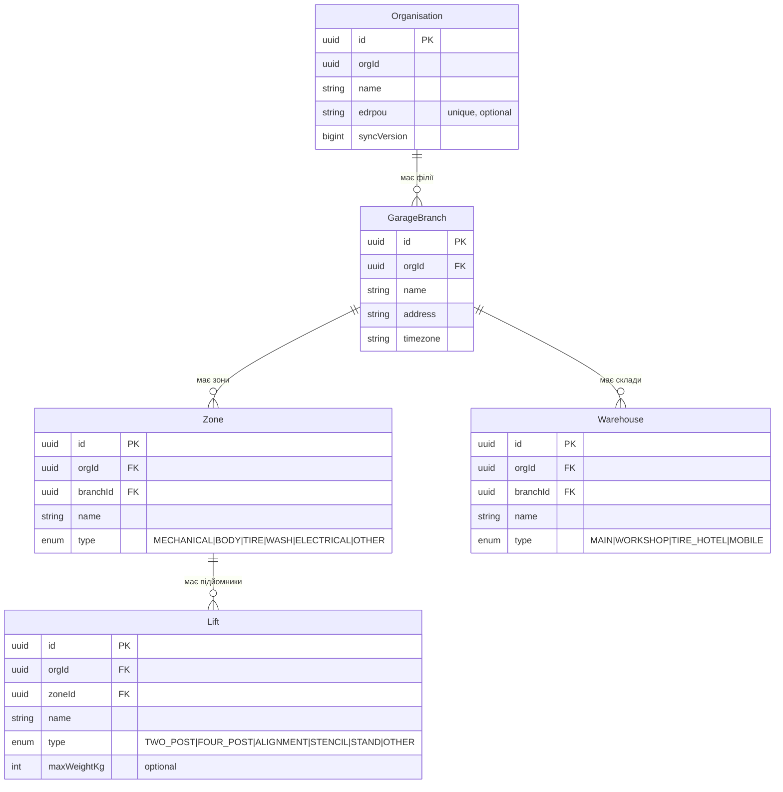
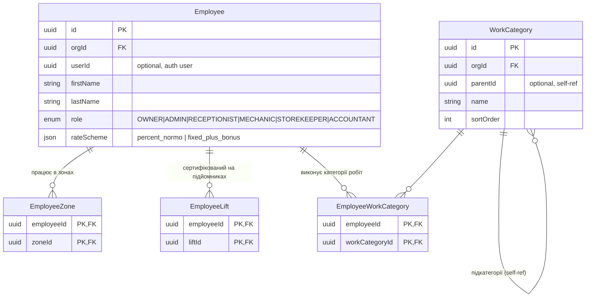
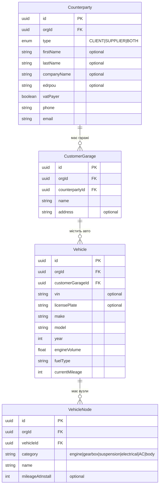
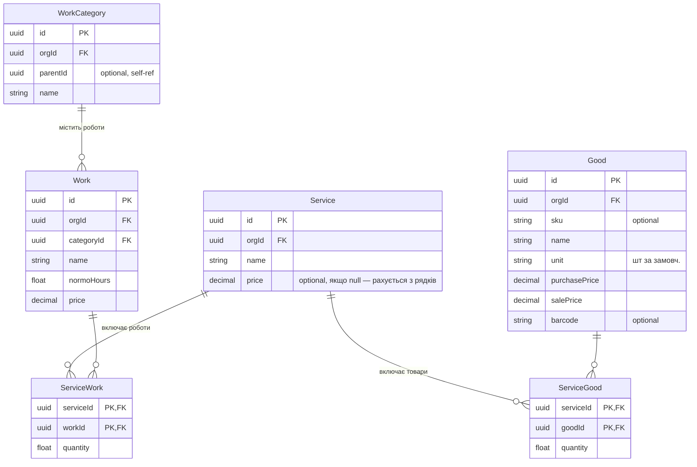
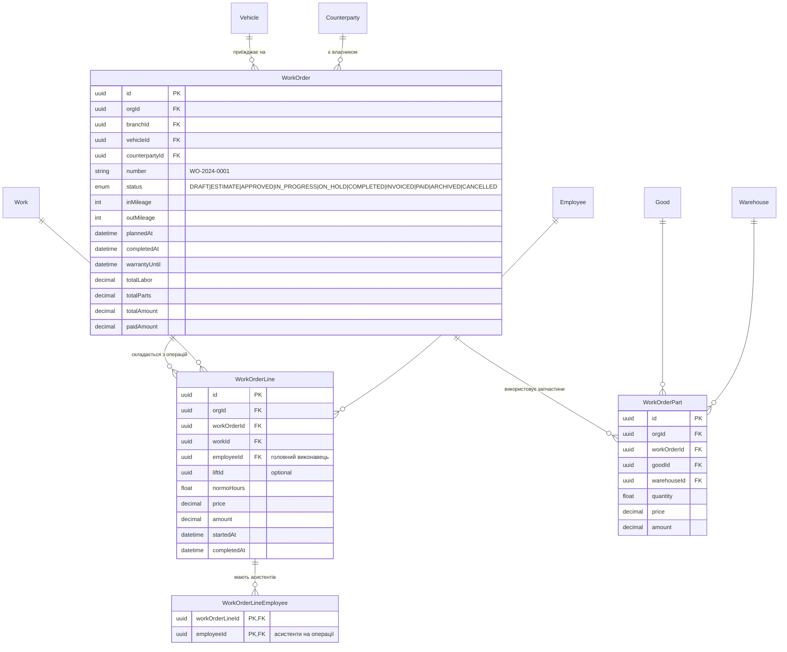

# STO ERP — Entity-Relationship Diagram

> Авторитетна візуальна модель БД. Джерело правди — `packages/database/schema.prisma`  
> Оновлювати синхронно з кожною зміною схеми.

---

## Зміст

- [Огляд bounded contexts](#огляд-bounded-contexts)
- [1. Інфраструктура](#1-інфраструктура)
- [2. Співробітники](#2-співробітники)
- [3. CRM — Контрагенти та Гараж клієнта](#3-crm)
- [4. Каталог послуг](#4-каталог-послуг)
- [5. Наряди (Work Orders)](#5-наряди)
- [6. Склад та Запаси](#6-склад)
- [7. Фінанси та Взаєморозрахунки](#7-фінанси)
- [8. Календар](#8-календар)
- [9. Налаштування та нумерація](#9-налаштування)
- [Повна схема зв'язків](#повна-схема-звязків)

---

## Огляд bounded contexts

```
┌─────────────────────────────────────────────────────────────┐
│                      Organisation                           │
│  ┌──────────────┐  ┌──────────────┐  ┌──────────────────┐  │
│  │ Infrastructure│  │  Employees   │  │       CRM        │  │
│  │ GarageBranch  │  │  Employee    │  │  Counterparty    │  │
│  │ Zone / Lift   │  │  Zones/Lifts │  │  CustomerGarage  │  │
│  │ Warehouse     │  │  WorkCats    │  │  Vehicle/Node    │  │
│  └──────────────┘  └──────────────┘  └──────────────────┘  │
│  ┌──────────────┐  ┌──────────────┐  ┌──────────────────┐  │
│  │   Catalog    │  │ Work Orders  │  │    Inventory     │  │
│  │ WorkCategory  │  │  WorkOrder   │  │  StockItem       │  │
│  │ Work / Good   │  │  Lines/Parts │  │  StockMovement   │  │
│  │ Service       │  │  CalSlots    │  │  PurchaseOrder   │  │
│  └──────────────┘  └──────────────┘  │  StockDocument   │  │
│                                       └──────────────────┘  │
│  ┌──────────────────────────────────────────────────────┐   │
│  │                     Finance                          │   │
│  │  Invoice  →  Payment  →  SettlementAccount           │   │
│  │                       →  SettlementTransaction       │   │
│  │                       →  ReconciliationAct           │   │
│  └──────────────────────────────────────────────────────┘   │
│  ┌──────────────────────────────────────────────────────┐   │
│  │                    Settings                          │   │
│  │  OrganisationSettings  BranchSettings                │   │
│  │  DocumentNumberConfig  PaymentMethodConfig           │   │
│  │  NotificationTemplate  TaxRate                       │   │
│  └──────────────────────────────────────────────────────┘   │
└─────────────────────────────────────────────────────────────┘
```

> **Ключові правила схеми:**
> - Кожна таблиця має: `id UUID`, `orgId UUID`, `createdAt`, `updatedAt`, `deletedAt?`, `syncVersion BigInt`
> - Soft delete скрізь: `deletedAt IS NULL` у всіх запитах
> - Append-only таблиці (без deletedAt): `StockMovement`, `SettlementTransaction`, `Payment`, `ReconciliationAct`

---

## 1. Інфраструктура



---

## 2. Співробітники



---

## 3. CRM



---

## 4. Каталог послуг



---

## 5. Наряди



---

## 6. Склад

```mermaid
erDiagram
    StockItem {
        uuid id PK
        uuid orgId FK
        uuid goodId FK
        uuid warehouseId FK
        float quantity "поточний залишок"
        float reserved "зарезервовано"
        float minStock "optional, поріг сигналу"
        "UNIQUE(orgId, goodId, warehouseId)"
    }

    StockMovement {
        uuid id PK
        uuid orgId FK
        uuid goodId FK
        uuid warehouseId FK
        enum type "RECEIPT|WRITEOFF|TRANSFER|RESERVATION|RESERVATION_RELEASE"
        float quantity "позитивне=прихід, від'ємне=витрата"
        decimal price "optional"
        string documentType "WorkOrder|PurchaseOrder|Writeoff|Transfer"
        uuid documentId "optional"
        "APPEND-ONLY — не редагується"
    }

    PurchaseOrder {
        uuid id PK
        uuid orgId FK
        uuid supplierId FK
        uuid warehouseId FK
        string number
        string status "DRAFT|ORDERED|RECEIVED|PARTIAL|CANCELLED"
        decimal totalAmount
    }

    PurchaseOrderLine {
        uuid id PK
        uuid purchaseOrderId FK
        uuid goodId FK
        float quantity
        decimal price
        float receivedQty
    }

    StockDocument {
        uuid id PK
        uuid orgId FK
        uuid branchId FK
        string number "авто, з DocumentNumberConfig"
        enum type "WRITEOFF|TRANSFER|OPENING_BALANCE"
        enum status "DRAFT|CONFIRMED|CANCELLED"
        uuid warehouseId FK "склад-джерело"
        uuid targetWarehouseId "optional, для TRANSFER"
        string notes "optional"
    }

    StockDocumentLine {
        uuid id PK
        uuid orgId FK
        uuid stockDocumentId FK
        uuid goodId FK
        float quantity
        decimal price "optional, облікова ціна для OPENING_BALANCE"
    }

    Good ||--o{ StockItem : "залишки по складах"
    Warehouse ||--o{ StockItem : ""
    Good ||--o{ StockMovement : "рухи по товару"
    Warehouse ||--o{ StockMovement : ""
    Counterparty ||--o{ PurchaseOrder : "постачальник"
    Warehouse ||--o{ PurchaseOrder : "на склад"
    PurchaseOrder ||--o{ PurchaseOrderLine : "рядки замовлення"
    Good ||--o{ PurchaseOrderLine : ""
    Warehouse ||--o{ StockDocument : "склад операції"
    StockDocument ||--o{ StockDocumentLine : "рядки документа"
    Good ||--o{ StockDocumentLine : ""
```

---

## 7. Фінанси

```mermaid
erDiagram
    Invoice {
        uuid id PK
        uuid orgId FK
        uuid counterpartyId FK
        uuid workOrderId "optional"
        string number
        decimal amount
        string status "DRAFT|SENT|PAID|CANCELLED"
        datetime dueDate "optional"
    }

    Payment {
        uuid id PK
        uuid orgId FK
        uuid counterpartyId FK
        uuid workOrderId "optional"
        uuid invoiceId "optional"
        decimal amount
        enum method "CASH|CARD_TERMINAL|BANK_TRANSFER|PRIVAT24_QR|MONOBANK_QR|CRYPTO"
        string fiscalReceiptId "Checkbox ID"
        "APPEND-ONLY"
    }

    SettlementAccount {
        uuid id PK
        uuid orgId FK
        uuid counterpartyId FK,UNIQUE
        decimal balance "поточний баланс"
    }

    SettlementTransaction {
        uuid id PK
        uuid orgId FK
        uuid settlementAccountId FK
        enum type "CHARGE|PAYMENT|REFUND|PREPAYMENT|CREDIT_NOTE"
        decimal amount
        string documentType "WorkOrder|Invoice|Payment|PurchaseOrder"
        uuid documentId "optional"
        "APPEND-ONLY"
    }

    ReconciliationAct {
        uuid id PK
        uuid orgId FK
        uuid counterpartyId FK
        datetime periodFrom
        datetime periodTo
        decimal openingBalance
        decimal closingBalance
        json snapshotJson "заморожений масив транзакцій"
    }

    Counterparty ||--|| SettlementAccount : "має рахунок"
    SettlementAccount ||--o{ SettlementTransaction : "транзакції"
    Counterparty ||--o{ Invoice : "виставлені рахунки"
    WorkOrder ||--o{ Invoice : "до наряду"
    Invoice ||--o{ Payment : "оплати"
    WorkOrder ||--o{ Payment : "прямі оплати"
    Counterparty ||--o{ ReconciliationAct : "акти звірки"
```

---

## 9. Налаштування

```mermaid
erDiagram
    DocumentNumberConfig {
        uuid id PK
        uuid orgId FK
        enum documentType "WORK_ORDER|INVOICE|PURCHASE_ORDER|STOCK_RECEIPT|STOCK_WRITEOFF|STOCK_TRANSFER|STOCK_OPENING|RECONCILIATION_ACT"
        string prefix "optional, напр. СТО або АВТО"
        boolean includeDate "default true"
        string dateFormat "YYYY | YYYYMM | YYYYMMDD"
        string separator "default -"
        int padding "кількість цифр, default 6"
        bigint currentSeq "поточний лічильник"
        string resetPeriod "never | yearly | monthly"
        "UNIQUE(orgId, documentType)"
        "Приклад: СТО-20240521-000001"
    }

    Organisation ||-