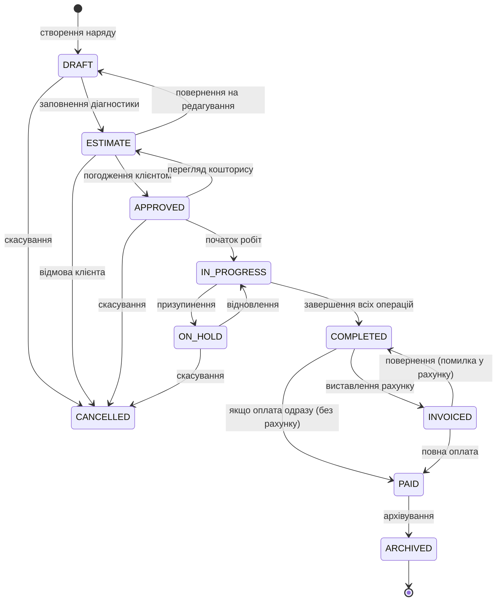
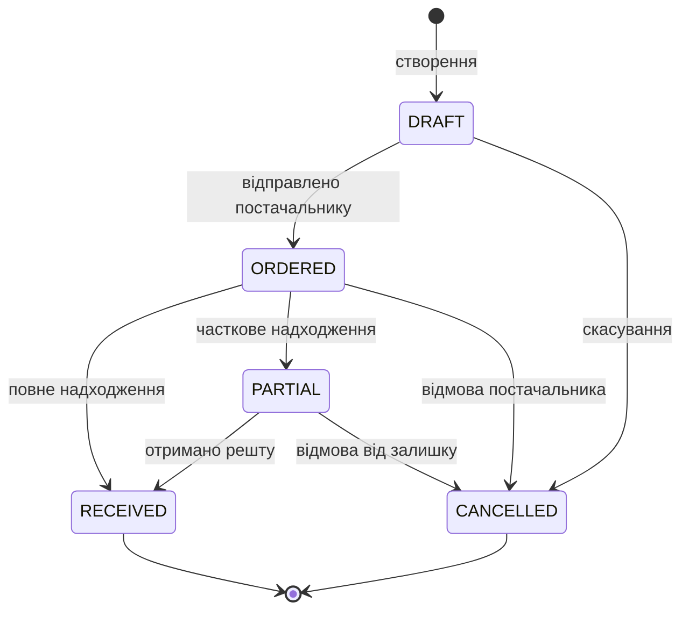
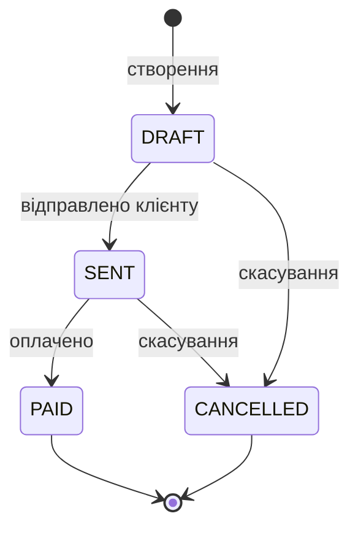
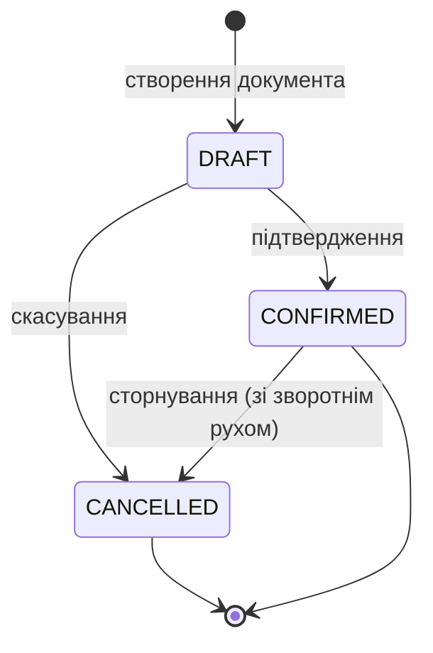

# STO ERP — Автомати станів (FSM)

> Авторитетне джерело дозволених переходів. Claude Code читає цей файл щоб генерувати коректні `transition()` методи.  
> **Заборонено** додавати переходи в код без оновлення цього файлу.

---

## Зміст

- [1. WorkOrder — Наряд](#1-workorder)
- [2. PurchaseOrder — Замовлення постачальнику](#2-purchaseorder)
- [3. Invoice — Рахунок](#3-invoice)
- [4. StockDocument — Складські операції](#4-stockdocument)
- [5. SyncJob — Синхронізація з хмарою](#5-syncjob)

---

## 1. WorkOrder

### Діаграма станів



### Таблиця переходів

| З → До | Guard умови | Side Effects | Хто може |
|--------|-------------|--------------|----------|
| `DRAFT → ESTIMATE` | Є хоча б одна операція (WorkOrderLine) | - | RECEPTIONIST, ADMIN, OWNER |
| `DRAFT → CANCELLED` | - | Звільнити CalendarSlot | RECEPTIONIST, ADMIN, OWNER |
| `ESTIMATE → APPROVED` | Клієнт підтвердив (phone/SMS) | emit `WorkOrderApproved` | RECEPTIONIST, ADMIN, OWNER |
| `ESTIMATE → DRAFT` | - | - | RECEPTIONIST, ADMIN, OWNER |
| `ESTIMATE → CANCELLED` | - | Звільнити CalendarSlot | RECEPTIONIST, ADMIN, OWNER |
| `APPROVED → IN_PROGRESS` | Є хоча б один механік призначений | emit `WorkOrderStarted`, записати `startedAt` | MECHANIC, RECEPTIONIST, ADMIN |
| `APPROVED → ESTIMATE` | - | - | ADMIN, OWNER |
| `APPROVED → CANCELLED` | - | Звільнити CalendarSlot | ADMIN, OWNER |
| `IN_PROGRESS → ON_HOLD` | Причина зазначена в notes | emit `WorkOrderOnHold` | MECHANIC, RECEPTIONIST, ADMIN |
| `IN_PROGRESS → COMPLETED` | Всі WorkOrderLine.completedAt заповнені | emit `WorkOrderCompleted`, записати `completedAt`, розрахувати totals | MECHANIC, RECEPTIONIST, ADMIN |
| `ON_HOLD → IN_PROGRESS` | - | emit `WorkOrderResumed` | MECHANIC, RECEPTIONIST, ADMIN |
| `ON_HOLD → CANCELLED` | - | Звільнити CalendarSlot | ADMIN, OWNER |
| `COMPLETED → INVOICED` | - | Створити Invoice автоматично | RECEPTIONIST, ADMIN, OWNER |
| `COMPLETED → PAID` | Оплата зафіксована через Payment | Запустити ПРРО фіскалізацію (BullMQ) | RECEPTIONIST, ADMIN, OWNER |
| `INVOICED → PAID` | `payment.amount >= workOrder.totalAmount` | Запустити ПРРО фіскалізацію (BullMQ) | RECEPTIONIST, ADMIN, OWNER |
| `INVOICED → COMPLETED` | - | Скасувати Invoice | ADMIN, OWNER |
| `PAID → ARCHIVED` | - | - | ADMIN, OWNER (автоматично через N днів) |

### Правила WorkOrder FSM в коді

```typescript
// apps/api/src/modules/work-orders/work-orders.service.ts

const TRANSITIONS: Record<WorkOrderStatus, WorkOrderStatus[]> = {
  DRAFT:       ['ESTIMATE', 'CANCELLED'],
  ESTIMATE:    ['APPROVED', 'DRAFT', 'CANCELLED'],
  APPROVED:    ['IN_PROGRESS', 'ESTIMATE', 'CANCELLED'],
  IN_PROGRESS: ['ON_HOLD', 'COMPLETED'],
  ON_HOLD:     ['IN_PROGRESS', 'CANCELLED'],
  COMPLETED:   ['INVOICED', 'PAID'],
  INVOICED:    ['PAID', 'COMPLETED'],
  PAID:        ['ARCHIVED'],
  ARCHIVED:    [],
  CANCELLED:   [],
};

async transition(id: string, to: WorkOrderStatus, userId: string, orgId: string) {
  const wo = await this.prisma.workOrder.findFirst({
    where: { id, orgId, deletedAt: null },
  });
  if (!wo) throw new NotFoundException('Наряд не знайдено');

  const allowed = TRANSITIONS[wo.status];
  if (!allowed.includes(to)) {
    throw new BadRequestException(
      `Перехід ${wo.status} → ${to} не дозволено`
    );
  }

  // Guard checks...
  await this.checkGuards(wo, to);

  // Update + side effects
  const updated = await this.prisma.workOrder.update({
    where: { id },
    data: {
      status: to,
      ...(to === 'IN_PROGRESS' && { startedAt: new Date() }),
      ...(to === 'COMPLETED' && { completedAt: new Date() }),
    },
  });

  this.eventEmitter.emit(`work-order.${to.toLowerCase()}`, updated);
  return updated;
}
```

---

## 2. PurchaseOrder

### Діаграма станів



### Таблиця переходів

| З → До | Guard умови | Side Effects | Хто може |
|--------|-------------|--------------|----------|
| `DRAFT → ORDERED` | Є хоча б один рядок замовлення | Відправити email/Viber постачальнику (BullMQ) | STOREKEEPER, ADMIN, OWNER |
| `DRAFT → CANCELLED` | - | - | STOREKEEPER, ADMIN, OWNER |
| `ORDERED → RECEIVED` | Всі `receivedQty >= quantity` | `InventoryService.createMovement(RECEIPT)` для кожного рядка | STOREKEEPER, ADMIN |
| `ORDERED → PARTIAL` | Хоча б один `receivedQty > 0` але не всі | `InventoryService.createMovement(RECEIPT)` для отриманих | STOREKEEPER, ADMIN |
| `ORDERED → CANCELLED` | - | Якщо є часткове отримання — заборонити | ADMIN, OWNER |
| `PARTIAL → RECEIVED` | Отримано все | `InventoryService.createMovement(RECEIPT)` для залишку | STOREKEEPER, ADMIN |
| `PARTIAL → CANCELLED` | - | Підтвердження від OWNER | OWNER |

---

## 3. Invoice

### Діаграма станів



### Таблиця переходів

| З → До | Guard умови | Side Effects | Хто може |
|--------|-------------|--------------|----------|
| `DRAFT → SENT` | - | Відправити рахунок на email/Viber (BullMQ) | RECEPTIONIST, ACCOUNTANT, ADMIN, OWNER |
| `DRAFT → CANCELLED` | - | Якщо пов'язано з WorkOrder — повернути до COMPLETED | ADMIN, OWNER |
| `SENT → PAID` | Зафіксовано Payment | `SettlementsService.createTransaction(PAYMENT)` | RECEPTIONIST, ACCOUNTANT, ADMIN |
| `SENT → CANCELLED` | - | - | ADMIN, OWNER |

---

## 4. StockDocument

### Діаграма станів



### Таблиця переходів

| З → До | Guard умови | Side Effects | Хто може |
|--------|-------------|--------------|----------|
| `DRAFT → CONFIRMED` | Є хоча б один рядок | Атомарно: `InventoryService.createMovement()` для кожного рядка; записати `confirmedAt`, `confirmedBy` | STOREKEEPER, ADMIN, OWNER |
| `DRAFT → CANCELLED` | — | — | STOREKEEPER, ADMIN, OWNER |
| `CONFIRMED → CANCELLED` | — | Атомарно: створити зворотні `StockMovement` для кожного рядка (сторно) | ADMIN, OWNER |

### Специфіка по типах

| Тип документа | Guard | StockMovement що створюється |
|---------------|-------|------------------------------|
| `WRITEOFF` | `StockItem.quantity >= sum(lines.quantity)` | `WRITEOFF` зі складу-джерела |
| `TRANSFER` | Джерело і ціль — різні склади; `quantity` доступна | `WRITEOFF` з джерела + `RECEIPT` на ціль |
| `OPENING_BALANCE` | Немає (дозволяємо будь-яку кількість) | `OPENING_BALANCE` на склад |

---

## 5. SyncJob (Cloud Sync)

> Актуально тільки якщо включена хмарна синхронізація.

```mermaid
stateDiagram-v2
    [*] --> PENDING : постановка в чергу

    PENDING --> IN_PROGRESS : воркер підхопив

    IN_PROGRESS --> COMPLETED : успішно
    IN_PROGRESS --> FAILED : помилка
    IN_PROGRESS --> RETRYING : тимчасова помилка

    RETRYING --> IN_PROGRESS : повторна спроба
    RETRYING --> FAILED : вичерпано спроби

    FAILED --> PENDING : ручний перезапуск
    COMPLETED --> [*]
    FAILED --> [*] "після DLQ обробки"
```

---

## Загальні правила FSM

1. **Ніколи не оновлювати статус напряму** — тільки через `service.transition()`
2. **Guard перевірки — перед записом у БД** — якщо guard не пройдено, кидаємо `BadRequestException` з українським повідомленням
3. **Side effects — після успішного запису** — через EventEmitter2, щоб транзакція не залежала від зовнішніх сервісів
4. **BullMQ для зовнішніх API** — ПРРО, SMS, Email завжди через чергу, ніколи напряму
5. **Аудит переходів** — кожен перехід логувати з `userId`, `fromStatus`, `toStatus`, `timestamp`

